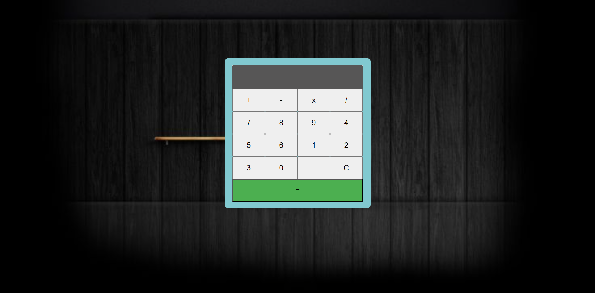

# PRACTICA DE JAVASCRIPT - CALCULADORA INTERACTIVA

## Creacion de la calculadora

En mi HTML define una calculadora interactiva que consiste en una pantalla que se visualiza (input de tipo texto) y un conjunto de botones que representan numeros,operaciones matemáticas y funciones de limpieza y calculo. Cada boton tiene un identificador único (id) para identificar su función en el script JavaScript.

```html
<!DOCTYPE html>
<html lang="en">
<head>
    <meta charset="UTF-8">
    <meta name="viewport" content="width=device-width, initial-scale=1.0">
    <title>Document</title>
    <link rel="stylesheet" href="style.css">
</head>
<body>
    <div class="calculadora">
        <input type="text" class="info" id="Info" readonly>
        <div class="button">
            <button class="btn calculo" id="suma">+</button>
            <button class="btn calculo" id="resta">-</button>
            <button class="btn calculo" id="multiplicacion">x</button>
            <button class="btn calculo" id="division">/</button>
            <button class="btn calculo" id="siete">7</button>
            <button class="btn calculo" id="ocho">8</button>
            <button class="btn calculo" id="nueve">9</button>
            <button class="btn calculo" id="cuatro">4</button>
            <button class="btn calculo" id="cinco">5</button>
            <button class="btn calculo" id="seis">6</button>
            <button class="btn calculo" id="uno">1</button>
            <button class="btn calculo" id="dos">2</button>
            <button class="btn calculo" id="tres">3</button>
            <button class="btn calculo zero" id="zero">0</button>
            <button class="btn calculo" id="decimal">.</button>
            <button class="btn clear" id="limpiar">C</button>
            <button class="btn equal" id="resultado">=</button>
        </div>
    </div>

    <script src="app.js"></script>
</body>
</html>
```

## Estilos de mi calculadora interactiva 

En mi codigo CSS proporciona el estilo visual de mi calculadora en una pagina web. Define la apariencia de la pantalla de visualizacion,los botones y utilizando una imagen de fondo con URL de ruta absoluta. Además establece el diseño de la pagina centrando el contenido vertical y horizontalmente y utilizando ajustando automáticamente al tamaño de la ventana del navegador.



## Funcional de la calculadora

En mi Javascript define el comportamiento de mi calculadora interactiva. Utiliza eventos para detectar clics en los botones y actualizar la pantalla de visualización con los numeros y operaciones seleccionadas por el usuario. Ademas realiza los calculos correspondientes cuando se presiona el botón de igual " = " y muestra el resultado en la pantalla.

```javascript
document.addEventListener('DOMContentLoaded', function () {
    const display = document.getElementById('Info');
    const buttons = document.querySelectorAll('.btn');

    buttons.forEach(button => {
        button.addEventListener('click', () => {
            if (button.textContent === 'C') {
                display.value = ''; 
            } else if (button.textContent === '=') {
                
                const expression = display.value.replace('x', '*'); 
                const result = eval(expression);
                display.value = result || 'Error'; 
            } else {
                display.value += button.textContent;
            }
        });
    });
});
```

## Authors

- [@Mauricio Pereda Ruiz](https://github.com/MauriPereda05)